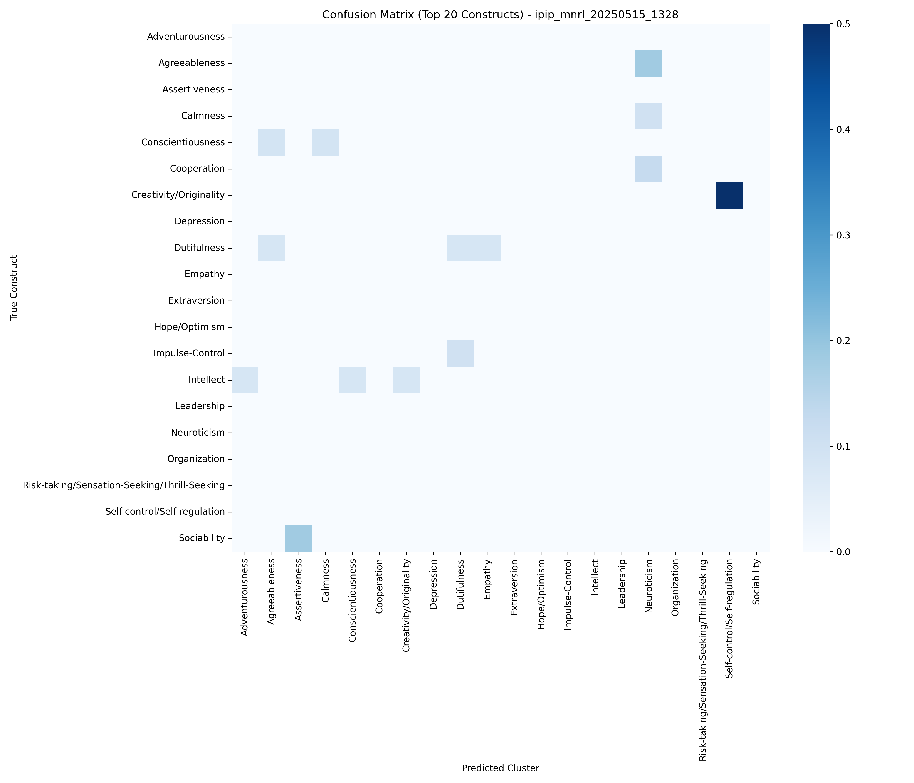
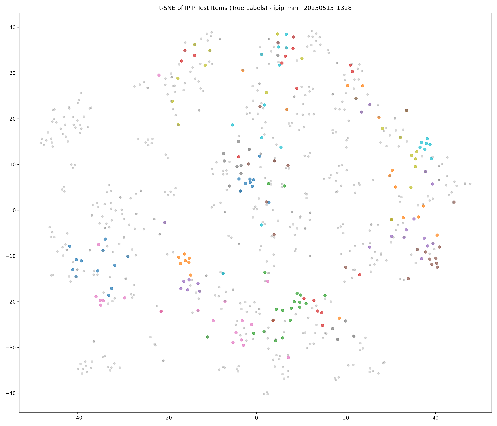
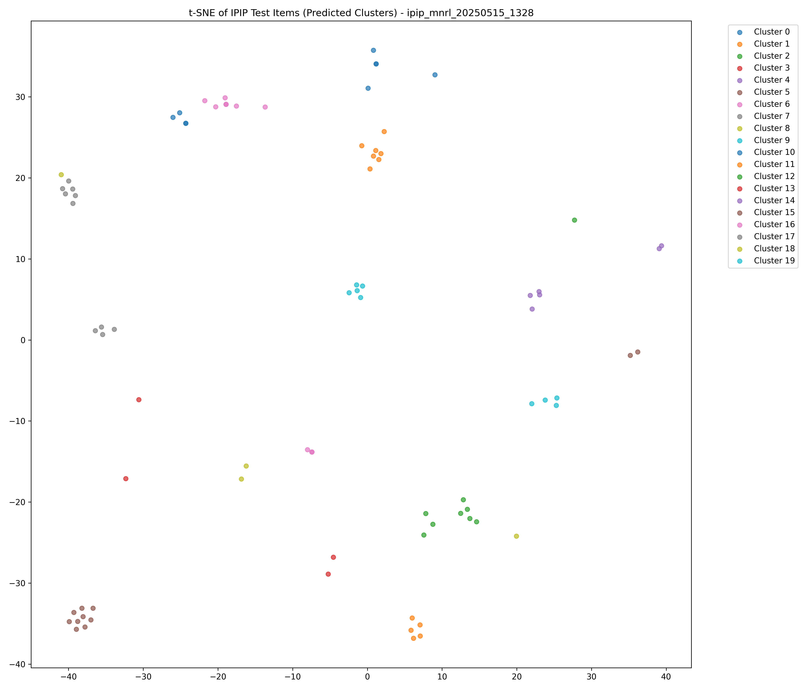
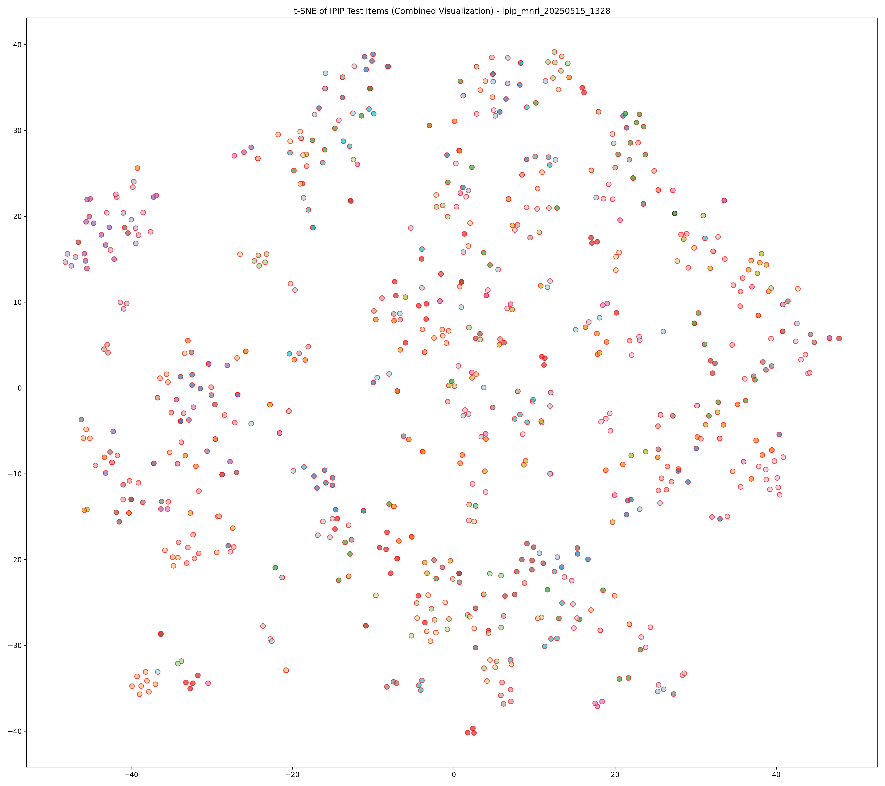
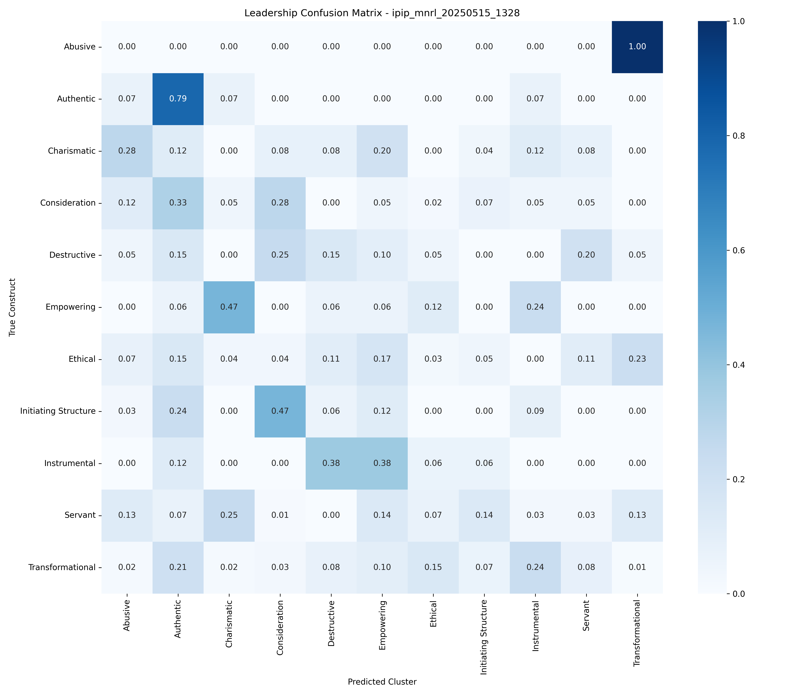
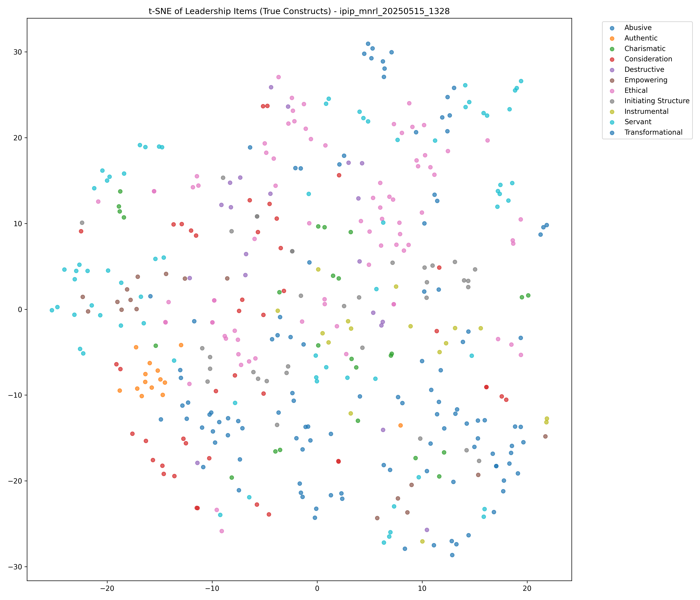
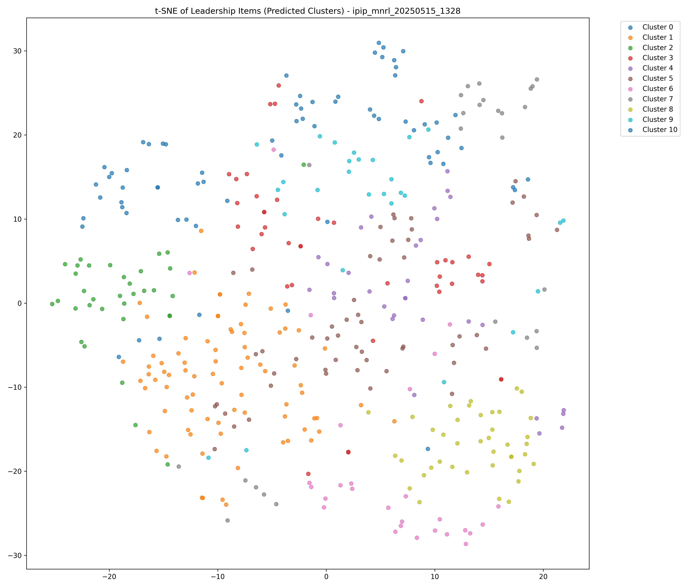
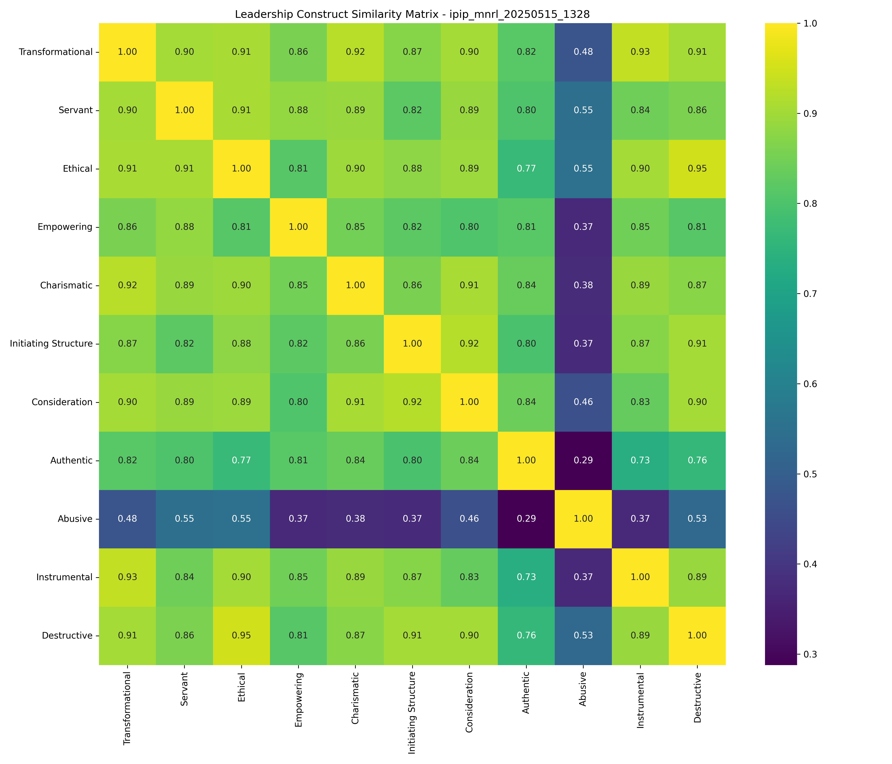

# MNRL Model Evaluation Report

*Generated on 2025-05-15*

## Executive Summary

This report presents the evaluation results of our IPIP MNRL (Multiple Negatives Ranking Loss) model trained on comprehensive personality item pairs. We assess how effectively the model clusters both personality items and leadership items by their respective construct categories.

### Key Findings

**IPIP Personality Data**:
- **Adjusted Rand Index (ARI)**: 0.2507
- **Normalized Mutual Information (NMI)**: 0.8206
- **Cluster Purity**: 0.5650

**Leadership Construct Data**:
- **Adjusted Rand Index (ARI)**: 0.0685
- **Normalized Mutual Information (NMI)**: 0.2170
- **Cluster Purity**: 0.3825

The substantial drop in metrics from IPIP to leadership data supports our research hypothesis that leadership constructs have significant overlap and are less distinctly separated than personality constructs.

## IPIP Personality Constructs Evaluation

The model shows moderate performance in clustering personality items by their construct categories, significantly above random assignment. This indicates the model successfully captures semantic relationships between items within the same personality construct.

### IPIP Clustering Visualizations

#### Confusion Matrix

#### t-SNE Visualization (True Labels)

#### t-SNE Visualization (Predicted Clusters)

#### Combined t-SNE Visualization

## Leadership Constructs Evaluation

The model shows much lower performance on leadership data, with clustering metrics significantly below those for personality constructs. This suggests that leadership constructs, as currently measured, do not form semantically distinct categories.

### Leadership Clustering Visualizations

#### Leadership Confusion Matrix

#### Leadership t-SNE Visualization (True Labels)

#### Leadership t-SNE Visualization (Predicted Clusters)

#### Leadership Construct Similarity

### Leadership Construct Overlap Analysis

The analysis reveals substantial overlap between leadership constructs. Below are the most similar construct pairs (similarity > 0.85):

| Construct Pair | Similarity |
|---------------|------------|
| Destructive & Ethical | 0.9476 |
| Instrumental & Transformational | 0.9346 |
| Charismatic & Transformational | 0.9231 |
| Consideration & Initiating Structure | 0.9194 |
| Charismatic & Consideration | 0.9075 |
| Ethical & Servant | 0.9067 |
| Ethical & Transformational | 0.9058 |
| Destructive & Transformational | 0.9054 |
| Destructive & Initiating Structure | 0.9053 |
| Ethical & Instrumental | 0.9049 |
| Consideration & Destructive | 0.9037 |
| Consideration & Transformational | 0.9029 |
| Servant & Transformational | 0.9028 |
| Charismatic & Ethical | 0.8971 |
| Consideration & Ethical | 0.8923 |
| Charismatic & Servant | 0.8911 |
| Charismatic & Instrumental | 0.8900 |
| Destructive & Instrumental | 0.8898 |
| Consideration & Servant | 0.8898 |
| Empowering & Servant | 0.8840 |
| Ethical & Initiating Structure | 0.8797 |
| Charismatic & Destructive | 0.8743 |
| Initiating Structure & Transformational | 0.8716 |
| Initiating Structure & Instrumental | 0.8695 |
| Destructive & Servant | 0.8604 |
| Empowering & Transformational | 0.8573 |
| Charismatic & Initiating Structure | 0.8572 |

## Conclusion

The results strongly support our research hypothesis that leadership constructs, as currently measured in the literature, have substantial semantic overlap and are less distinctly separated than personality constructs. Many leadership construct pairs show similarity values above 0.85, indicating they may be measuring essentially the same underlying concept despite having different names.

This suggests that the current taxonomic structure of leadership measurement may be artificially complex, with many constructs capturing similar underlying concepts. Future research should focus on identifying a more parsimonious set of truly distinct leadership dimensions.

## Appendix: Model and Evaluation Details

- **Model**: MNRL (Multiple Negatives Ranking Loss) with all-mpnet-base-v2 base model
- **Training Data**: Comprehensive and balanced anchor-positive IPIP item pairs
- **IPIP Evaluation**: Test set of 761 items across 220 constructs
- **Leadership Evaluation**: 434 items across 11 constructs
